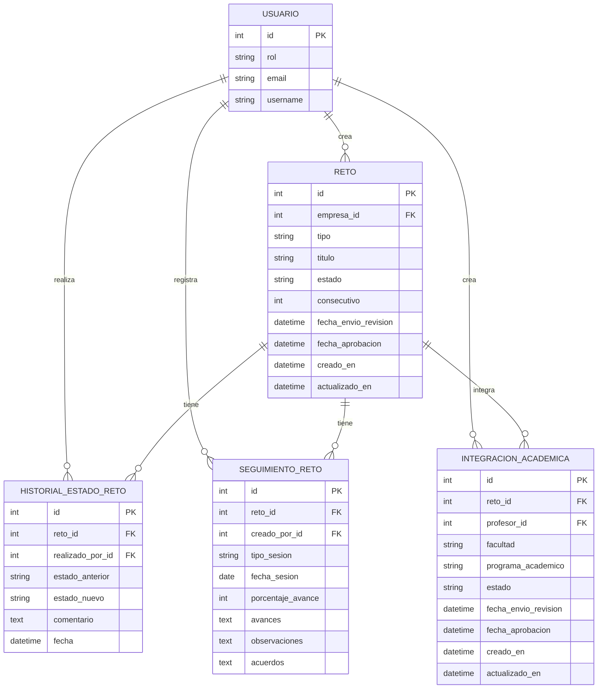

# Rama Caicedo - Modulo de Retos e Integraciones

Esta rama implementa el flujo base para que empresas, profesores y administradores gestionen retos, hackatones, integraciones academicas y seguimientos dentro de la plataforma Retos EAN.

## Alcance principal

- Creacion, edicion, envio a revision y eliminacion de retos por parte de usuarios con rol Empresa.
- Revision administrativa de retos, con aprobacion, rechazo, cambio manual de estado y asignacion de consecutivo.
- Registro de historial de cambios de estado para conservar trazabilidad del ciclo de vida de cada reto.
- Registro de seguimientos sobre retos aprobados o activos.
- Creacion, edicion, envio a revision y publicacion de integraciones academicas por parte de usuarios con rol Profesor.
- Revision administrativa de integraciones academicas.
- Vistas y plantillas HTML para formularios, paneles, detalles, estados y confirmaciones del modulo `retos`.
- Reorganizacion de la configuracion Django en `config/settings/` con archivos separados para base, desarrollo y produccion.
- Estructura inicial de apps de dominio bajo `apps/` para preparar el crecimiento modular del proyecto.

## Modelos incluidos

- `Reto`: representa retos o hackatones creados por empresas, con estados como borrador, en revision, aprobado, rechazado, en curso, pausado, finalizado y cancelado.
- `HistorialEstadoReto`: guarda cada cambio de estado de un reto, el usuario que lo realizo y el comentario asociado.
- `SeguimientoReto`: registra sesiones, avances, observaciones y acuerdos sobre un reto.
- `IntegracionAcademica`: conecta un reto aprobado o activo con una propuesta academica creada por un profesor.

## Sistema de base de datos

El entorno de desarrollo usa SQLite por defecto para que el proyecto pueda
iniciarse sin instalar ni configurar un servidor de base de datos. Produccion
usa PostgreSQL. Para usar PostgreSQL tambien en desarrollo, configure
`DB_ENGINE=postgresql` y las siguientes variables en `.env`:

- `DB_NAME`: nombre de la base de datos.
- `DB_USER`: usuario de PostgreSQL.
- `DB_PASSWORD`: clave del usuario.
- `DB_HOST`: host del servidor de base de datos, normalmente `localhost`.
- `DB_PORT`: puerto de PostgreSQL. En `.env.example` se usa `5433`.

El esquema se administra con migraciones de Django. En esta rama el modulo `retos` incluye su migracion inicial para crear las tablas de retos, historial de estados, seguimientos e integraciones academicas. Los modelos se relacionan con el usuario personalizado mediante `settings.AUTH_USER_MODEL`, por eso las tablas dependen tambien de las migraciones de `usuarios`.

Relaciones principales:

- Un usuario Empresa puede tener muchos `Reto`.
- Un `Reto` puede tener muchos registros de `HistorialEstadoReto`.
- Un `Reto` puede tener muchos `SeguimientoReto`.
- Un `Reto` puede tener muchas `IntegracionAcademica`.
- Un usuario Profesor puede tener muchas `IntegracionAcademica`.

Diagrama de relaciones:



Flujo recomendado para trabajar con la base de datos:

```bash
python manage.py makemigrations
python manage.py migrate
python manage.py check
```

Cada cambio en `models.py` debe incluir su migracion correspondiente. Si dos ramas crean migraciones al mismo tiempo y Django detecta ramas paralelas en el historial, se debe resolver con:

```bash
python manage.py makemigrations --merge
python manage.py migrate
```

## Sprints 6 y 7: evaluacion, seguimiento y cierre formal

El commit `030e717` completa el ciclo academico y administrativo de los retos.
La implementacion cubre la evaluacion formal de entregables, el monitoreo de
avance por parte de la empresa y el cierre documentado del reto.

### Sprint 6 - Evaluacion y seguimiento

- Los entregables pueden asociarse al reto, estudiante y equipo participante.
- Un estudiante puede registrar varios entregables parciales o finales usando
  un nombre diferente para cada entrega.
- Al cargar nuevamente un entregable con el mismo nombre, se actualiza el
  archivo y vuelve al estado pendiente de evaluacion.
- El profesor vinculado al reto dispone de un panel para descargar, revisar,
  calificar y retroalimentar cada entregable.
- La calificacion puede usar una escala libre configurable por entregable o una
  rubrica con multiples criterios y puntajes maximos.
- La nota, el estado y la retroalimentacion quedan visibles para el estudiante.
- Los comentarios de profesores y estudiantes se conservan como un historial
  ordenado por fecha y usuario.
- La empresa cuenta con una vista de seguimiento de solo lectura que muestra el
  porcentaje de avance, la bitacora y los entregables parciales/finales.
- La empresa no puede modificar calificaciones ni registrar cambios en el
  seguimiento academico. Los intentos directos mediante `POST` son rechazados.

Modelos principales agregados o ampliados:

- `Entregable`: equipo, titulo, tipo parcial/final y puntaje maximo.
- `Rubrica` y `CriterioRubrica`: configuracion de evaluacion por reto.
- `Evaluacion` y `EvaluacionCriterio`: resultado general y detalle por criterio.
- `ComentarioEntregable`: trazabilidad de comentarios e interacciones.

### Sprint 7 - Cierre formal del reto

- El administrador dispone de un panel con los retos aprobados, activos,
  pausados o finalizados.
- La agenda de cierre registra fecha, espacio, recursos, invitados y actividades.
- El cierre permite cargar el acta y uno o varios entregables finales.
- Se pueden registrar premios y reconocimientos para estudiantes participantes.
- Antes de finalizar se valida que exista una agenda completa, acta de cierre y
  al menos un entregable final.
- La finalizacion se ejecuta en una transaccion: cambia el reto a `finalizado`,
  registra el cambio en el historial, genera encuestas y notifica a la empresa,
  profesores y estudiantes participantes.
- Cada participante puede responder o actualizar su encuesta de satisfaccion
  con una calificacion de 1 a 5 y un comentario.
- La operacion es idempotente: repetir la finalizacion no duplica encuestas ni
  notificaciones.

Modelos principales agregados o ampliados:

- `AgendaCierre`: logistica completa del evento de cierre.
- `CierreReto`: acta, responsable y fecha efectiva de cierre.
- `EntregableFinal`: documentacion final asociada al cierre.
- `Reconocimiento`: premios por estudiante.
- `EncuestaSatisfaccion`: retroalimentacion individual de los participantes.

### Permisos implementados

| Accion | Administrador | Profesor | Empresa | Estudiante |
| --- | --- | --- | --- | --- |
| Configurar rubrica y calificar | No | Si, en retos vinculados | No | No |
| Consultar avance empresarial | No | No | Si, solo retos propios | No |
| Modificar seguimiento academico | Si | Si | No | No |
| Gestionar y finalizar cierre | Si | No | No | No |
| Responder encuesta asignada | No | Si | Si | Si |

### Verificacion

La entrega incluye migraciones para `evaluacion` y `cierre`, registros en el
administrador de Django y pruebas de integracion para calificaciones, permisos,
seguimiento empresarial, cierre, notificaciones y encuestas. Al generar el
commit se ejecutaron correctamente los 15 tests del proyecto:

```bash
python manage.py test
python manage.py makemigrations --check --dry-run
python manage.py check
```

## Rutas principales

- `/retos/mis-retos/`: listado de retos de la empresa.
- `/retos/crear/`: creacion de retos.
- `/retos/<id>/`: detalle del reto.
- `/retos/<id>/seguimientos/`: historial de seguimientos del reto.
- `/retos/admin/panel/`: panel administrativo de revision de retos.
- `/retos/integraciones/`: listado de integraciones del profesor.
- `/retos/integraciones/crear/`: creacion de integraciones academicas.
- `/retos/admin/integraciones/`: panel administrativo de revision de integraciones.
- `/evaluacion/profesor/`: panel de evaluacion y calificacion del profesor.
- `/evaluacion/profesor/reto/<id>/rubrica/`: configuracion de rubrica.
- `/empresas/seguimiento/`: monitoreo de avance de la empresa.
- `/cierre/admin/`: panel administrativo de cierre.
- `/cierre/admin/reto/<id>/`: agenda, documentos y formalizacion del cierre.
- `/cierre/encuestas/`: encuestas asignadas al participante autenticado.

## Configuracion local

1. Crear y activar un entorno virtual.
2. Instalar dependencias:

```bash
pip install -r requirements.txt
```

3. Opcionalmente, crear un archivo `.env` basado en `.env.example`. Solo es
   necesario configurar PostgreSQL si se desea usarlo en desarrollo.
4. Ejecutar migraciones:

```bash
python manage.py migrate
```

5. Levantar el servidor:

```bash
python manage.py runserver
```

## Settings

- Desarrollo: `config.settings.development`
- Produccion: `config.settings.production`

## Notas para continuar

- Validar el flujo completo con usuarios Empresa, Profesor y Admin.
- Agregar pruebas enfocadas para permisos, transiciones de estado y formularios.
- Mantener las migraciones junto con cualquier cambio futuro en modelos.
- Evitar secretos en el repositorio; usar `.env` para credenciales y variables de entorno.
